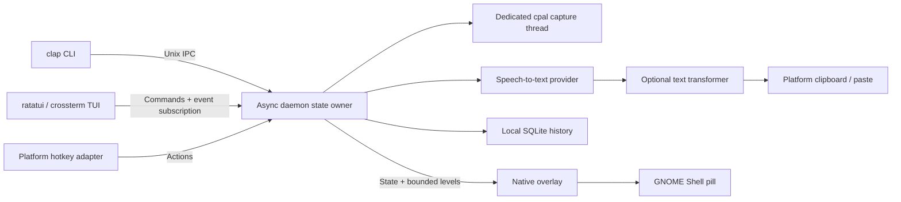

# Architecture

Revision: 2026-10-02. The integrated Rust workspace contains `xflow-core`, `xflow-providers`, `xflow-platform`, and `xflow-app`; the app crate builds the `xflow` CLI/TUI and `xflowd` daemon. The current design distinguishes implemented behavior from proposed extensions; desktop acceptance remains incomplete. Research supporting these choices is in [docs/RESEARCH.md](docs/RESEARCH.md), and release stages are in [ROADMAP.md](ROADMAP.md).

## Process and crate boundaries

The CLI and TUI are clients and consume event-driven state updates; they do not poll the daemon for UI state. Closing either must not terminate an active daemon. The daemon owns session state, capture lifecycle and finalized output. Heavy optional engines and compositor rendering must not enter the core contract crate. A native Shell extension is a small GNOME-specific renderer, not a WebView. The CLI/TUI and integrations are development-slice work, not evidence of a validated desktop release.

| Crate | Responsibility |
| --- | --- |
| `xflow-core` | Shared serializable state/config/IPC contracts and platform/provider traits |
| `xflow-providers` | WAV encoding, batch STT adapters, optional text cleanup and credential resolution; live credentials unvalidated |
| `xflow-platform` | cpal capture, desktop copy/paste and GNOME integration; physical-device path unvalidated |
| `xflow-app` | Daemon state owner/storage/IPC plus `xflow` CLI/TUI and `xflowd` daemon binaries; UI state updates are event-driven |

No Electron, embedded browser or default local model runtime. Reuse native capture/IPC/overlay ideas from whisrs while keeping this implementation independent; any future source reuse requires the upstream MIT notices.

## Existing trait contracts

The canonical declarations are in `crates/xflow-core/src/lib.rs`:

| Contract | Meaning and boundary |
| --- | --- |
| `SpeechToText` | `name`, `model`, `warm`, `supports_streaming`, async `transcribe(AudioClip, TranscriptionOptions) -> Transcript`; raw input is interleaved normalized f32 PCM with explicit sample rate/channels |
| `StreamingSpeechSession` | `send_audio`, `next_partial`, consuming `finish` and `cancel`; future streaming must return a finalized transcript before insertion |
| `TextTransformer` | Independent optional `transform(TransformRequest) -> String`; no credentials or STT implementation required by this trait |
| `AudioCapture` | Async `start`, `stop -> AudioClip`, `cancel`, `finished` and cheap latest `level`; capture ownership remains on the dedicated thread |
| `Desktop` | `context -> AppContext`, `inject(text, target) -> InjectionOutcome`, `copy`, `selection`; distinguishes `Pasted`, `Typed` and `ClipboardOnly` |
| `GlobalHotkeys` | Event-based `next_action -> HotkeyAction`; actions are start/stop/toggle/cancel/paste-last |
| `Overlay` | `update(DesktopEvent)` with state, normalized level, mode and optional message |

`AppContext` contains optional app/window identifiers and selected text. An empty context is an honest capability limitation, not proof of context discovery. The MVP's combined `Desktop` trait is intentionally small; split clipboard/context/injection interfaces only when a real second implementation requires independent ownership.

`supports_streaming` currently distinguishes batch from streaming, but cannot on its own expose language, vocabulary, selection, hotkey-release or overlay support. Future adapters should add tested capability descriptions and typed unsupported/permission errors. Until then, diagnostics and returned errors must make missing capability visible; do not set a flag just because a protocol-shaped method exists.

## Daemon state and cancellation

States are `Idle`, `Listening`, `Processing`, `Success`, `Error`. The single state owner serializes commands and session completions. Capture and HTTP work run outside command dispatch so status/cancel stay responsive. A session identity or equivalent stale-result guard ensures that completion from a cancelled recording cannot affect a newer session.

Start creates one capture session. Stop takes ownership of its finalized clip and starts transcription. Toggle maps to start/stop by state; conflicting starts during processing report busy. Cancel aborts the active job, stops capture, and advances a generation guard that rejects stale completions. If the transcript was already finalized and saved, cancel cannot undo its history entry or `last` recovery text; queued cancellation is processed before injection starts when possible. `clear-history` cancels active work, clears the database and clears `last`. Daemon `Success`/`Error` persists until a new recording or cancel; the GNOME overlay independently hides success/error after 1.5/4 seconds.

Silent/empty recordings produce no upload. The lightweight energy gate is not a neural speech classifier: quiet speech and noise still require hardware evaluation. Maximum duration and a hard sample/memory budget cap capture. Callback work must avoid blocking operations and must surface overflow/device errors instead of returning plausible but truncated audio.

Later streaming uses bounded audio queues and separates partial preview from committed text. It does not type unstable provider hypotheses into another app. Completed batch upload is never described as realtime streaming.

## IPC and UI events

The app IPC path uses event-driven subscription for UI state, rather than polling. Unix domain IPC is used on Linux/macOS. A future Windows transport may use a named pipe with the same serialized request/response contracts. `xflow-core::ipc` includes status/start/stop/toggle/cancel, last/copy/paste-last, paged/searchable history, history get/delete/copy/paste, clear-history, stats, reload, subscribe and shutdown requests, with a 64 KiB maximum message contract. The transport implementation must enforce that cap before allocating unbounded input and limit slow clients.

Place the socket in a user-private runtime directory and restrict permissions. A fallback directory must be private and validate ownership; never trust a publicly writable predictable socket path. Reject malformed/oversized requests and bound read/write time. Subscription clients get current state then events without polling. Slow or disconnected subscribers must not block audio or command handling.

Audio remains inside the capture/provider pipeline. Normal UI events carry state and level, not raw audio. Transcript-bearing responses are explicit local requests or controlled finalized output; logs must not duplicate their payloads. Coalesce waveform updates to a small active cadence and stop publishing periodic levels while idle.

## Provider transport and secret boundaries

The integrated catalog includes ten cloud batch STT adapters plus custom/local servers (see [provider contracts](crates/xflow-providers/README.md)). Groq uses multipart WAV upload. OpenRouter uses a distinct JSON/base64 `input_audio` request; the [official reference](https://openrouter.ai/docs/api/api-reference/stt/create-transcription) is the contract, not assumptions based on an OpenAI-looking URL. A custom OpenAI-compatible REST adapter accepts a full transcription endpoint; it is not arbitrary-protocol support. Language/vocabulary fields are only sent when supported. Model-dependent limits and rejected fields need clear user diagnostics.

Reuse HTTP clients across sessions, apply deadlines and bound response bodies. Reject empty/malformed successful responses. Do not return raw server bodies or request URLs containing credentials in logs. No automatic provider failover: audio must stay with the explicitly configured endpoint. Future retry policy must distinguish transient failures and avoid repeating completed billable requests or injection.

Configuration is TOML with strict field validation. Secrets are resolved through configured environment references and OS keyring storage where available; they are not TOML values. Local endpoints may require no credentials, but cloud adapters must reject missing keys before recording/upload when possible. Optional LLM cleanup is independently configured; raw bypasses it. Cleanup failure should preserve usable STT output and expose that cleanup failed rather than silently discard dictation.

Offline rejects non-loopback STT and cleanup endpoints before network access. Compatible local servers and the whisper.cpp server protocol are implemented; users manage the server and model themselves. Managed model downloads and sidecar lifecycle remain future work. A local server's own network behavior is outside this guard. A WebSocket URL alone cannot implement arbitrary streaming: each protocol needs framing, finalization, cancellation and fixture tests.

## Storage and retention

SQLite WAL stores bounded local transcript history. The default retention is 500 entries; configuration permits up to 100,000. Queries apply limits before returning rows; preferences/configuration remain local. History schema v2 adds model/raw text/app/language/duration/latency/mode metadata. Dictionary, snippets and per-app styles live in validated TOML and run through the deterministic text pipeline; they are not SQLite placeholder tables.

History-disabled sessions must not write transcript text, although copy-last may retain a transient in-memory result for recovery. Clearing history must also be clear about transient last-result state and backups. Private directory/file permissions protect against other users, not arbitrary processes running under the same account. No audio files by default, no telemetry sender, and no secret/transcript content in routine logging.

SQLite writes are serialized and bounded; blocking database operations stay outside latency-sensitive capture callbacks. Transactional history migration and atomic comment-preserving settings writes are implemented. Encryption-at-rest is not implied by a local SQLite file.

## Platform strategy and truthful fallback

| Platform/session | Initial approach | Release status / later work |
| --- | --- | --- |
| Ubuntu GNOME Wayland | cpal audio; session-bus bridge + native Shell pill; toggle/hold/smart shortcuts; native Shell injection with guarded utility fallbacks | Primary integration target; physical microphone, live provider credentials, actual paste and input-device/uinput operation require desktop acceptance; physical hold/smart shortcut behavior remains an acceptance gate |
| GNOME X11 | Same core; X11 utilities can provide paste | Basic adapter path is not tested-desktop certification; dedicated hotkey/overlay acceptance later |
| Fedora GNOME | Reuse GNOME design, verify packages, security policy and Shell compatibility | Later distro gate |
| wlroots compositors | Compositor bindings; native layer-shell overlay; virtual-keyboard protocol when exposed, uinput/paste fallback | Separate adapter and verification later |
| KDE Wayland | Probe native/portal shortcut and context capability; KDE-specific overlay | Separate adapter and verification later |
| Generic X11 | X11 shortcut/context/overlay adapter; clipboard + synthetic key fallback | Dedicated integration later |
| macOS | Accessibility focus/selection, CGEvent input, native nonactivating panel, Keychain | Design only; permission and signing/package validation later |
| Windows | UI Automation/SendInput, native overlay, credential manager, named-pipe IPC | Architectural possibility; no shipped support claim |

The [GlobalShortcuts portal](https://flatpak.github.io/xdg-desktop-portal/docs/doc-org.freedesktop.portal.GlobalShortcuts.html) specifies activation/release signals, but every runtime must probe actual backend support. The GNOME extension implements release-aware hold/smart shortcuts alongside toggle; physical desktop validation remains pending. Direct uinput/evdev permissions should be minimal and explicit; the daemon must not run as root to obtain them. GNOME prefers the native Shell virtual keyboard; the fallback invokes `ydotool` where configured; direct uinput operation and actual destination delivery remain unvalidated. `ydotool` and `xdotool` success indicates an attempted key action, not a verified editable target.

Clipboard transport overwrites current content. Optional restoration preserves prior text only when the clipboard still holds the injected text; full MIME restoration remains unsupported. Missing paste capability produces clipboard-only recovery rather than a false pasted result. GNOME app/window identity drives guarded injection and per-app styles. Unknown or changed focus yields clipboard-only recovery; dispatch is not proof that the destination accepted text.

GNOME overlay rendering must not become the active window. Hide it when idle and disconnect D-Bus signals/timers on extension disable. Implemented position/size/opacity/waveform/animation preferences are bounded in GSettings; unsupported desktops retain CLI/TUI operation. Shell renderer CPU and memory are measured separately from daemon RSS.

## Auto-learning dictionary: design only

This feature has no automatic observer in the MVP. Proposed adapters use AT-SPI on Linux, macOS Accessibility and Windows UI Automation only after explicit opt-in. No polling of arbitrary app contents.

1. After confirmed insertion, create a short-lived in-memory receipt: session, app/window, accessible editable element, inserted text/span and available change generation. Clipboard-only output supplies no receipt. If insertion/span identity is uncertain, observe nothing.
2. Subscribe only to that element's text-change events, scoped to the inserted span. Expire after 30 seconds, focus/element changes, selection ambiguity or unrelated document edits. Do not capture passwords, protected fields, terminal buffers or unsupported widgets.
3. Align original inserted text with the changed span. A candidate must be a narrow spelling/casing correction, initially one token (at most three for a proper-name phrase), not a sentence rewrite, deletion, punctuation-only change or command. Require stable surrounding anchors and at most two candidate edits in a session. These numbers are conservative proposed limits to calibrate, not validated confidence thresholds.
4. Normalize comparison without changing stored replacement spelling. Reject digits/URLs/secrets, broad semantic replacements and edits outside the span. For example, `postgress -> Postgres` may qualify; replacing an entire paragraph never qualifies. Ambiguous tokenizer/language cases remain review-only.
5. Persist only candidate source/replacement, language/app scope, observation count, confidence evidence and timestamps. Never persist the whole observed document. Score repeated independent sessions; proposed promotion requires three consistent observations and no conflicting correction. Provider confidence alone is insufficient.
6. Trusted promotion remains inspectable/reversible in dictionary management. Explicit user rules override learned rules. Deleted learned mappings have a tombstone to prevent re-learning; users can disable/clear observations. Conflicts lower confidence and require review, never broad automatic replacement.

Evaluate this with synthetic event traces: eligible spelling edits, unrelated typing, late edits, focus switches, stale offsets, Unicode, accessibility denial, conflicting corrections, large rewrites and deletion tombstones. Ship observation first in suggestion-only mode with a precision-oriented review set; automatic promotion follows only after false-positive evidence is acceptable. The absence of accessibility support must leave dictation usable.

## Main implementation risks

The largest risks are session cancellation races, mic format/device failure, ambiguous focus, input permissions, GNOME extension API changes, clipboard data loss and cloud latency. The smallest working slice tests these directly before introducing local model runtimes, background document observers or broad command actions. [PERFORMANCE.md](PERFORMANCE.md) defines the timing/resource boundaries and [ROADMAP.md](ROADMAP.md) defines promotion gates.
