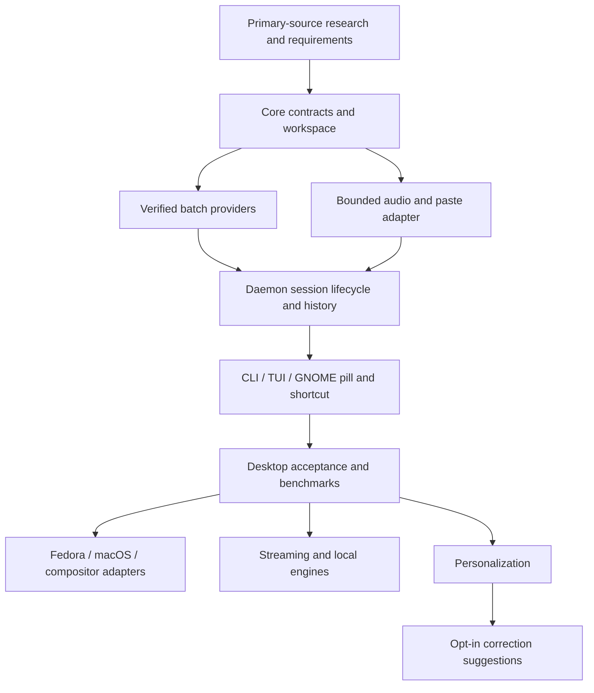

# Roadmap

Revision: 2026-09-30. Milestones are completion gates, not a list of already shipped capabilities. The parent branch currently holds the shared contracts; provider, platform and app slices are in sibling worktrees and require integration and desktop acceptance. Measured results belong in checked-in benchmark reports described by [PERFORMANCE.md](PERFORMANCE.md). The complete product direction is in [PRD.md](PRD.md).

## Dependency order

## 0. Research and design

Deliver PRD, architecture, roadmap, performance methodology and dated research. Study Wispr's current official behavior and whisrs source/license. Establish strict MVP scope, platform/provider boundaries and auto-learning design-only status. Complete when citations support claims and requirements distinguish hardware verification from mocks. This milestone requires no new provider account or MCP service.

## 1. Ubuntu GNOME development slice

Integrate the already-developed Rust contracts, provider, platform and app slices: async daemon, event-driven CLI/TUI state updates, native cpal capture, Groq/OpenRouter batch STT and custom OpenAI-compatible REST, optional independent cleanup, SQLite WAL history (default 500 entries), clipboard/paste fallback, and native GNOME pill. This remains a development slice, not a desktop-validated release. Global toggle is the first shortcut path; true release-aware GNOME push-to-talk is not implemented and requires new work, then adapter and desktop validation.

Automated verification must cover configuration validation, wire format/error bounds, secrets not leaking, silence/length limits, serialized state transitions, cancelled/stale completion rejection, history retention/no-history and IPC framing. Fixture audio and mock HTTP enable reproducible software checks. They do not replace physical microphone/live API/destination checks.

Exit: the integrated implementation can run as a local development slice, errors are recoverable, missing optional integrations are visible, and no later feature is described as complete. Publish smoke results with their limitations. Until desktop checks pass, label the result a development scaffold, not a production-ready release.

## 2. Ubuntu desktop acceptance and release hardening

Use a declared Ubuntu/GNOME release and actual desktop session. Physical microphone capture, provider credential validation using authorized live accounts, direct uinput operation, and confirmed paste into editor/browser/terminal remain pending. Record built-in/USB device permissions and failure, short/long/silent recordings, live provider contracts, Unicode, changed focus, clipboard-only recovery, shortcut conflicts and GNOME extension disable/reenable/daemon restart. Add and validate release-aware PTT separately; the current GNOME shortcut is toggle-only.

Measure idle RSS/CPU, startup, hotkey-to-first-sample, stop-to-final-transcript, injection and overlay frame cost with the documented methodology. Profile regressions before optimizing. Test provider timeout/rate-limit/offline error, cancel during processing and recovery without duplicate paste. Harden private IPC, bounded clients, settings/history lifecycle, service startup/shutdown and diagnostics.

Exit: checked-in acceptance results and reproducible benchmark distributions; no unresolved loss-of-dictation/cancellation/privacy bugs; setup declares exact dependencies and tested desktops. Push-to-talk, editable per-app context and clipboard restoration are advertised only if validated. Performance budgets are evaluated on the declared reference hardware, not inferred from unit-test speed.

## 3. Fedora and additional native desktop adapters

Fedora GNOME follows the Ubuntu core but validates dependencies, user services, Shell versions and device/security permissions independently. Add dedicated wlroots, KDE and X11 hotkey/context/injection/overlay adapters. Prefer event-driven portal/native APIs when available and advertise missing capability rather than faking it.

Develop macOS Accessibility/CGEvent, nonactivating native pill and Keychain integration. Validate mic permissions, secure input, non-English keyboard layout, destination focus, sleep/resume and packaging/signing. Do not claim macOS support based on the portable Rust core compiling. Windows retains transport/trait feasibility and stays outside this milestone unless separately scoped.

Exit: each advertised desktop has its own acceptance matrix and performance report; optional integration failure preserves CLI/TUI recording and transcript recovery.

## 4. Streaming and offline engines

Add Deepgram and other verified streaming protocols behind streaming-session lifecycle tests: partial revision, finalization, disconnect, timeout, cancellation and language/hint capability. Keep partials preview-only initially. Arbitrary custom HTTP/WebSocket protocols require explicit payload/response mapping; URL configuration alone is insufficient.

Add optional whisper.cpp or compatible local sidecar, lazy startup and separate memory accounting. Offline mode must block all remote STT/cleanup without silent fallback. Test model missing/corrupt, sidecar crash, language quality, cancellation and resource limits. Establish accuracy and latency tradeoffs on measured hardware.

Exit: actual provider/local-engine contract and hardware verification; no model memory cost in the default cloud daemon; offline network-negative test and separate sidecar metrics.

## 5. User-managed personalization

Add SQLite migrations and CLI/TUI management for dictionary, explicit corrections and snippets. Deterministic matching needs token boundaries, overlapping-rule precedence, Unicode, contractions, literal expansions and no recursive expansion. Add vocabulary-hint capability reporting and a technical-term corpus before broad cleanup claims.

Add per-app writing styles and optional selected-text/context access after target identity is reliable. Context defaults to minimal metadata; opt-in text is bounded. Selected-text transforms and named voice actions require exact selection, stale-target checks, recovery and raw-output inspection. No automatic shell execution.

Exit: a quality corpus checks negation, false starts, identifiers, multilingual text and snippet/correction collisions; user settings have documented behavior and no silent provider-field drops.

## 6. Correction suggestions, then auto-learning

Implement the design in [ARCHITECTURE.md](ARCHITECTURE.md) only after reliable insertion receipts and accessibility adapters exist. Start with opt-in suggestion-only observation of a bounded inserted span. Measure candidate precision using replayable narrow edit traces and explicit negative cases. Later automatic promotion requires repeated evidence and reversible rules/tombstones.

Exit: scoped observation never consumes unrelated document content; large rewrites and protected fields never produce candidates; users can inspect/remove/disable learned rules; unavailable accessibility does not affect dictation. This is explicitly deferred from the initial implementation.

## Verification and risk ownership

Provider owners maintain request fixtures, limits and redaction. Platform owners maintain microphone, shortcut, clipboard, overlay and permissions acceptance. The daemon owner maintains cancellation, IPC, storage and lifecycle correctness. Performance evidence is reviewed at each new platform/backend gate. A milestone cannot be promoted by documentation alone: record exact commands, commit, environment and observed result, with skipped checks explicit.
